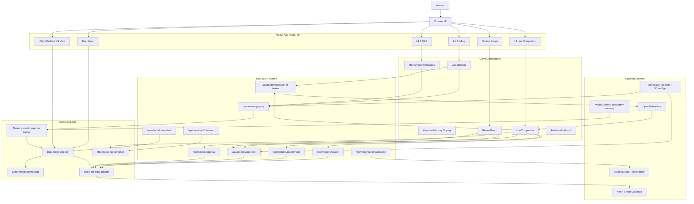
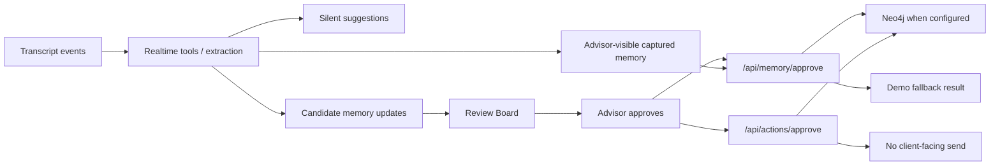
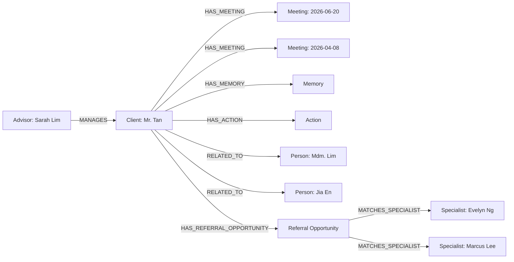

# Advisors' Advisor

Hackathon MVP for an AI memory operating system for financial advisors.

The demo follows one advisor, Sarah Lim, as she prepares for, runs, reviews, and follows up on a client meeting with Mr. Tan Wee Seng. The product story is simple: the advisor should never walk into a meeting cold, forget important context, miss a referral signal, or send client-facing follow-up without advisor control.

## Team Members

- **Sim Hong Bing**
- **Olivia Lim Yun Xuan**
- **MUTHURAMAN PALANIAPPAN**
- **Mohtasham Murshid Madani**
- **Lee Ping Xian**

## Challenge and Approach (Why choosing Track 1)

### The Challenge
Financial advisors manage high-stakes, long-term relationships with dozens of clients. Retaining crucial contextual details—such as family relationships, life milestones, personal preferences, unresolved client concerns, and follow-up promises—is challenging. Conventional CRMs are passive repositories that require tedious manual updates and active searching, often leading to missed opportunities, forgotten follow-ups, and fragmented client knowledge.

### Our Approach (Why choosing Track 1)
We chose **Track 1** because it aligns perfectly with our vision of building an intelligent, agent-gated cognitive assistant. Rather than creating a passive CRM or a simple chatbot, our approach focuses on:
1. **Graph-Shaped Memory (Neo4j):** Storing client relationships and histories in a graph database, mirroring the organic way advisors think about their networks.
2. **Real-time Multimodal Briefing (OpenAI WebRTC):** Allowing advisors to prepare for meetings through interactive voice and typed briefing sessions.
3. **Silent Live Companion:** Listening over OpenAI Realtime, surfacing live prompts, looking up relevant memory, and capturing useful facts without disrupting the advisor-client human interaction.
4. **OpenClaw Channel Memory:** Using OpenClaw for Telegram and WhatsApp workflows so chat context can feed memory, Q&A, and follow-up review instead of staying trapped in message threads.
5. **Self-Improving Memory And Forecasting:** Applying a pattern-memory loop inspired by [Visual Cortex Flow](https://github.com/frenzy2004/Visual-Cortex-Flow) so accepted/rejected signals can improve future memory surfacing and forecast likely advisor needs.
6. **Advisor-in-the-Loop Control:** Keeping client-facing follow-up actions behind explicit advisor approval while making captured memory visible and reviewable.

## What It Proves

- **L1 pre-meeting briefing:** advisor asks grounded voice or typed questions before a client meeting.
- **L1.5 adaptive memory display:** the same memory query can render as a brief answer, cards, table, graph, timeline, recommendation, or missing-info prompt.
- **L2 live meeting companion:** browser microphone capture over Realtime produces live captions, advisor-only prompts, targeted memory lookup, partner suggestions, and captured memory.
- **OpenClaw Telegram and WhatsApp path:** channel conversations can become advisor Q&A context, memory candidates, and follow-up review proposals.
- **Self-improving memory:** accepted and rejected advisor decisions inform future memory ranking and behavior forecasting.
- **Advisor-gated review:** follow-up actions and post-meeting memory proposals require explicit advisor approval.
- **Neo4j-shaped memory:** the app can run from demo data, real Neo4j data, or a hybrid of both.

## Demo Flow

The reliable 5-minute judge path:

1. Open `/dashboard` for the demo command center, or `/` to jump straight to the next briefing.
2. Ask a typed or voice question on the briefing page.
3. Open the live meeting companion at `/live/[meetingId]` and run the supplied meeting dialogue through live capture.
4. End and review the generated follow-ups and memory updates.
5. Approve one action and one memory.
6. Open the client profile and inspect the relationship graph, timeline, open items, and approved/recent memory.

Approval buttons do not send client-facing messages. They only mark advisor-reviewed output and, when Neo4j is configured, persist approved records to the memory layer.

## Technologies Used

| Layer | Technology | Why |
| --- | --- | --- |
| App framework | Next.js App Router | Server-rendered pages plus API routes in one deployable app. |
| UI | React 19, TypeScript, Tailwind CSS, lucide-react | Fast product surfaces with typed components and consistent iconography. |
| Voice briefing | OpenAI Realtime over browser WebRTC | Natural pre-meeting Q&A with server-minted ephemeral client secrets. |
| Live companion | OpenAI Realtime over browser WebRTC, Realtime tools, targeted API lookups | Low-friction meeting capture, live captions, advisor-only prompts, and memory/partner surfacing without a phone provider. |
| Channel automation | OpenClaw for Telegram and WhatsApp | External chat workflows can feed memory queries, passive context capture, and advisor-reviewed follow-up drafts. |
| Memory source | Neo4j driver | Client memory is naturally graph-shaped: advisor, client, family, meetings, referrals, actions. |
| Self-improving memory and forecasting | [Visual Cortex Flow](https://github.com/frenzy2004/Visual-Cortex-Flow) pattern-memory concept | Accepted/rejected decisions become feedback signals for better memory surfacing and next-best-behavior forecasting. |
| Demo fallback | Deterministic local seed data | Judges and contributors can run the MVP without external services. |
| Verification | TypeScript scripts, ESLint, Next build | Lightweight checks for demo flow, data mode, Neo4j connectivity, and production build. |

## System Architecture

The app is built as one Next.js product surface with server-rendered pages, client-side interactive components, API route boundaries, an explicit data-mode selector, and optional external services. The architecture is intentionally thin around integrations: product logic stays inside the web app and memory layer, while OpenAI and Neo4j are replaceable service boundaries.

### Runtime View



### Layer Responsibilities

| Layer | Responsibility | Key Files |
| --- | --- | --- |
| Route pages | Load selected data-mode context and compose product surfaces. | `app/page.tsx`, `app/dashboard/page.tsx`, `app/briefing/[meetingId]/page.tsx`, `app/qna/[meetingId]/page.tsx`, `app/live/[meetingId]/page.tsx`, `app/meeting/[meetingId]/page.tsx`, `app/post-meeting/[meetingId]/page.tsx`, `app/client/[clientId]/page.tsx` |
| Interactive UI | Voice session, adaptive memory display, live capture, review approvals, graph/timeline rendering. | `components/voice-briefing.tsx`, `components/memory-qna-workspace.tsx`, `components/live-companion.tsx`, `components/review-board.tsx`, `components/relationship-graph.tsx` |
| API boundary | Keeps browser code away from service secrets and normalizes OpenAI/Neo4j interactions. | `app/api/**/route.ts` |
| Memory access | Chooses `demo`, `hybrid`, or `neo4j`; reads context; writes approved or captured memory/action records. | `lib/neo4j-memory.ts`, `lib/demo-data.ts` |
| Query intelligence | Turns a natural memory query into answer text plus the best visual mode. | `lib/memory-query-response.ts` |
| Meeting and channel intelligence | Converts live transcript turns and OpenClaw channel context into suggestions, memory lookups, partner recommendations, and captured memory updates. | `components/live-companion.tsx`, `lib/neo4j-memory.ts`, `lib/demo-data.ts` |
| Feedback loop | Uses advisor decisions as memory-ranking and behavior-forecasting signals, inspired by Visual Cortex Flow's pattern-memory workflow. | `lib/neo4j-memory.ts`, `lib/memory-query-response.ts` |
| Domain contracts | Shared types for advisor, client, meeting, memory, action, graph, transcript, and visual response. | `lib/types.ts` |
| Validation | Fast local checks for MVP behavior, selected data source, Neo4j, and build readiness. | `scripts/*.ts` |

### Core Data Flow

```mermaid
sequenceDiagram
  participant Advisor
  participant UI as "Next.js UI"
  participant API as "API Routes"
  participant Data as "Data Mode Selector"
  participant Demo as "Demo Data"
  participant Graph as "Neo4j"

  Advisor->>UI: Open dashboard / briefing / Q&A / live / client page
  UI->>Data: Request client context
  Data->>Demo: Read deterministic journey when DATA_MODE=demo
  Data->>Graph: Read graph context when DATA_MODE=neo4j
  Data-->>UI: Advisor, client, meetings, memories, actions, graph
  Advisor->>UI: Ask memory question
  UI->>API: POST /api/memory/query
  API->>Data: Load current client context
  API-->>UI: Answer + display mode + evidence
  Advisor->>UI: Approve action or memory
  UI->>API: POST approval route
  API->>Graph: Save only if Neo4j is configured
  API-->>UI: Approved status; no client message sent
```

### L1: Pre-Meeting Realtime Briefing

The briefing page uses `VoiceBriefing` for both voice and typed Q&A.

1. Browser asks `POST /api/realtime/token` for a short-lived OpenAI Realtime client secret.
2. Server creates the Realtime session using `OPENAI_API_KEY`; the browser never receives the long-lived API key.
3. Browser opens a WebRTC session with OpenAI and sends microphone audio.
4. The Realtime assistant can call `query_client_memory`.
5. Browser answers that function call by posting to `/api/memory/query`.
6. `/api/memory/query` loads the selected data-mode client context and returns a `MemoryQueryVisualResponse`.
7. The UI shows the spoken/typed answer and the L1.5 adaptive display.

Fallbacks:

- Missing `OPENAI_API_KEY`: voice is disabled, typed Q&A still works.
- Mic denial: typed Q&A still works.
- Neo4j unavailable in `demo` or `hybrid`: deterministic memory remains available.

### L1.5: Adaptive Memory Display

Memory queries do not always render as chat. `lib/memory-query-response.ts` selects a display mode based on the query intent and available evidence.

| Display Mode | Used For | Example Query |
| --- | --- | --- |
| `brief` | Short answer from one or two facts. | "What should I remember?" |
| `cards` | Multiple high-salience memories. | "Summarize this client." |
| `table` | Actions, promises, follow-ups, reminders. | "What do I need to send?" |
| `graph` | Family, specialists, referral network. | "Who is connected to him?" |
| `timeline` | Prior meeting history and dated memory. | "What happened last time?" |
| `recommendation` | Referral or specialist next step. | "Who should I introduce?" |
| `missing_info` | No grounded evidence found. | "Does he have a brother?" |

This lets the same web interface answer as a table, graph, timeline, recommendation, or bullet-style summary depending on what is most useful.

### L2: Live Meeting Companion

The primary live meeting page is `/live/[meetingId]`. The older `/meeting/[meetingId]` route redirects there.

The active live companion uses OpenAI Realtime over browser WebRTC.

1. `LiveCompanion` requests microphone access when the advisor presses **Start**.
2. The browser asks `POST /api/realtime/token`, which reuses the `/api/realtime/session` implementation.
3. The server creates a short-lived OpenAI Realtime client secret with advisor-only live-companion instructions and tools.
4. The browser opens a WebRTC connection to OpenAI Realtime and streams meeting audio.
5. Realtime events update live captions and speaker attribution in the UI.
6. Realtime tool calls can search client memory, recommend a relevant partner, suggest a follow-up question, or capture a useful memory.
7. The UI shows live captions plus **Ask**, **Lookup**, **Saved**, and context panels.
8. Captured memory saves through `/api/memory/approve` with duplicate protection when Neo4j is configured.

The deterministic `/api/meetings/[meetingId]/events`, `/extract`, `/analyze`, and `/transcribe` routes remain useful for tests, compatibility, and non-Realtime transcript flows.

Current L2 is designed for a reliable hackathon demo. Full diarization, durable transcript storage, and production consent/retention controls are future work.

### Review And Write Path



The safety boundary is strict for outbound communication: approval marks an action or memory as advisor-reviewed. It does not send WhatsApp, Telegram, email, calendar invites, or client-facing messages.

### Neo4j Graph Shape

The seeded graph mirrors the advisor story and keeps relationships explicit:



Approved memory writes create a `Memory` node and, for supported categories, typed nodes such as `LifeEvent`, `Concern`, `Objective`, or `Promise`. The current client graph view focuses on the relationship/referral network; approved typed memory is surfaced in the client profile memory section and is ready for future graph expansion.

### Extension Points

Channel and future integrations should plug into the existing contracts instead of bypassing them:

- OpenClaw-powered WhatsApp and Telegram flows should convert allowlisted messages into `/api/memory/query`, transcript events, or review proposals.
- Better extraction should preserve the `ExtractedMemory` and `SilentSuggestion` contracts.
- Durable meeting sessions should persist transcript events before review.
- Expanded KG views should read from the same Neo4j memory adapter.
- Authentication should wrap the route/API layer without changing the core memory contracts.

For even more detail, see [docs/system-architecture.md](docs/system-architecture.md).

## Data Modes

The app supports three runtime data modes through `DATA_MODE`.

| Mode | Behavior | Best For |
| --- | --- | --- |
| `demo` | Uses deterministic local data only. No OpenAI or Neo4j required for the UI path. | Fast first run and judge fallback. |
| `hybrid` | Starts from demo journey and overlays Neo4j memory/actions/graph when available. | Resilient demos with partial graph connectivity. |
| `neo4j` | Requires Neo4j for calendar, client context, memories, actions, graph, and writes. Failures are visible. | Integration validation and real memory-layer proof. |

If `DATA_MODE` is unset, the app chooses `neo4j` only when Neo4j env vars exist. Otherwise it runs in `demo` mode.

## Quick Start

```bash
npm install
npm run check:data-source
npm run check:mvp
npm run dev
```

Open:

```text
http://localhost:3000
```

The zero-dependency path works without `.env.local` because it falls back to demo data.

## Optional Environment

Copy `.env.example` to `.env.local` only when you want to enable optional services.

```bash
cp .env.example .env.local
```

Important variables:

```bash
OPENAI_API_KEY=
OPENAI_REALTIME_MODEL=gpt-realtime-2
OPENAI_TRANSCRIBE_MODEL=whisper-1

DATA_MODE=demo

NEO4J_URI=bolt://localhost:7687
NEO4J_USERNAME=neo4j
NEO4J_PASSWORD=password
NEO4J_DATABASE=
```

Use `DATA_MODE=demo` for the safest local run. Switch to `DATA_MODE=neo4j` only after Neo4j is reachable and seeded.

## Neo4j Setup

When a local or Aura Neo4j database is available:

```bash
npm run check:neo4j
npm run seed:neo4j
DATA_MODE=neo4j npm run check:data-source
npm run check:neo4j-demo
```

What the scripts do:

- `check:neo4j` verifies the database connection.
- `seed:neo4j` writes the demo advisor, client, meetings, memories, actions, and relationship graph.
- `check:data-source` confirms the selected data mode returns usable client context.
- `check:neo4j-demo` writes a deterministic approved memory and verifies it appears in the client profile memory section.

## OpenAI Setup

Set `OPENAI_API_KEY` to enable:

- `/api/realtime/session` and `/api/realtime/token`, used by the pre-meeting Realtime voice briefing and live companion.
- `/api/meetings/[meetingId]/transcribe` and `/api/meetings/[meetingId]/analyze`, used by compatibility and test transcript flows.

Without `OPENAI_API_KEY`, the app still renders. The briefing and Q&A pages support typed memory Q&A, and deterministic route checks still exercise extraction logic. Realtime voice briefing and live capture require an OpenAI key.

## Main Routes

| Route | Purpose |
| --- | --- |
| `/` | Redirects to the next meeting briefing. |
| `/dashboard` | 5-minute demo command center and workflow map. |
| `/briefing/[meetingId]` | L1 pre-meeting voice and typed Q&A with adaptive L1.5 memory display. |
| `/qna/[meetingId]` | Standalone L1.5 memory Q&A surface for answer-first visual responses. |
| `/live/[meetingId]` | Primary L2 live companion with Realtime mic capture, captions, prompts, lookups, and captured memory. |
| `/meeting/[meetingId]` | Compatibility redirect to `/live/[meetingId]`. |
| `/post-meeting/[meetingId]` | Advisor approval board for follow-up actions and memory updates. |
| `/client/[clientId]` | Client context, timeline, graph, approved/recent memory, and open items. |

## Main API Routes

| Endpoint | Purpose |
| --- | --- |
| `POST /api/realtime/session` | Creates a short-lived OpenAI Realtime client secret for briefing or live companion mode. |
| `POST /api/realtime/token` | Backward-compatible export of the same Realtime session route. |
| `GET /api/demo/calendar` | Returns the selected data-mode calendar for dashboard-like flows. |
| `POST /api/memory/query` | Returns a normalized visual memory response for L1/L1.5. |
| `POST /api/memory/search` | Searches selected client memory for live companion tool calls. |
| `POST /api/partners/recommend` | Recommends a relevant advisor-network partner for a concrete live need. |
| `GET /api/clients/[clientId]/context` | Reads the selected data-mode client context. |
| `GET /api/clients/[clientId]/graph` | Reads the selected data-mode relationship graph. |
| `POST /api/meetings/[meetingId]/events` | Accepts transcript events for MVP compatibility. |
| `POST /api/meetings/[meetingId]/transcribe` | Transcribes meeting audio chunks when OpenAI is configured. |
| `POST /api/meetings/[meetingId]/extract` | Extracts deterministic suggestions and candidate memories from transcript events. |
| `POST /api/meetings/[meetingId]/analyze` | Runs live transcript analysis with OpenAI chat completion when configured. |
| `POST /api/actions/approve` | Marks a follow-up action as advisor-approved. No outbound message is sent. |
| `POST /api/memory/approve` | Saves an advisor-approved memory to Neo4j when configured, with demo fallback. |

## Verification

Run the main checks before pushing:

```bash
npm run lint
npm run check:data-source
npm run check:mvp
npm run check:l15-qna
npm run check:extra-journeys
npm run build
```

Run Neo4j-specific checks only when Neo4j env vars are real:

```bash
npm run check:neo4j
npm run seed:neo4j
DATA_MODE=neo4j npm run check:data-source
npm run check:neo4j-demo
DATA_MODE=neo4j npm run check:extra-journeys:neo4j
```

`npm run reset:neo4j-demo` previews non-seed data in the configured Neo4j database. Use `npm run reset:neo4j-demo -- --yes` only for a disposable demo database, because it deletes non-seed data before reseeding.
